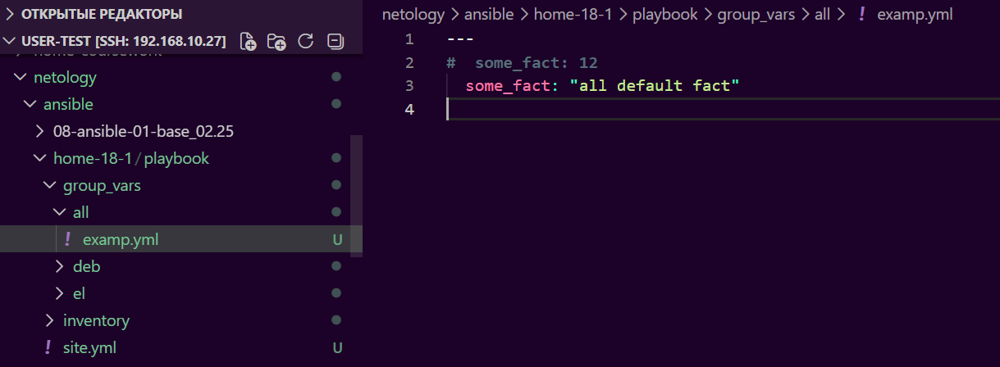
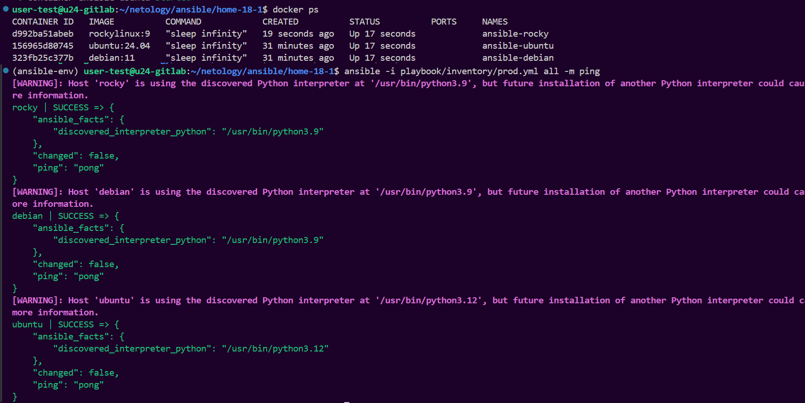
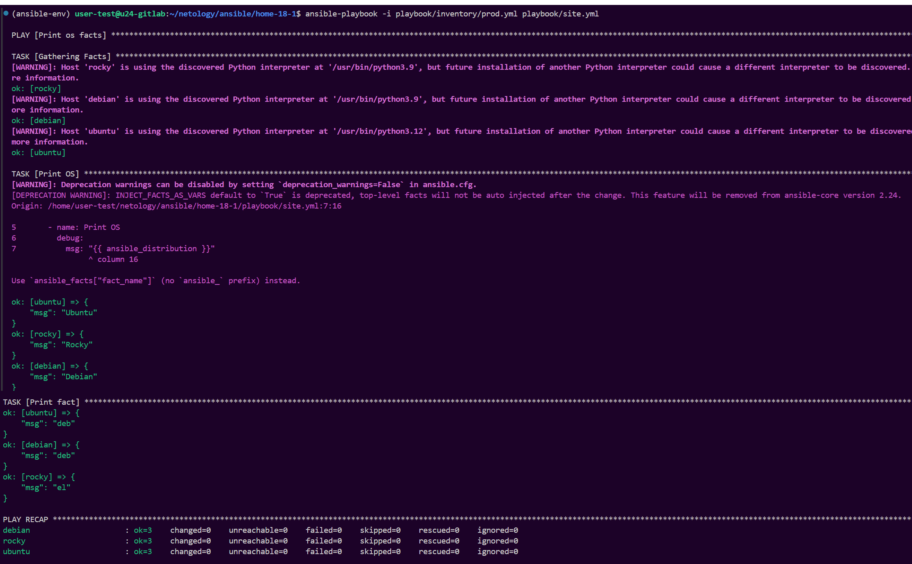
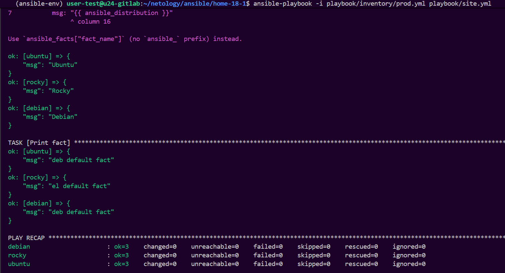
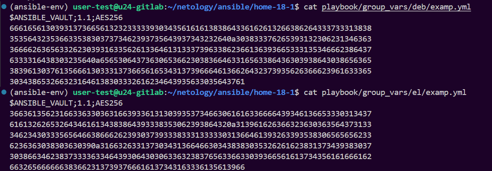
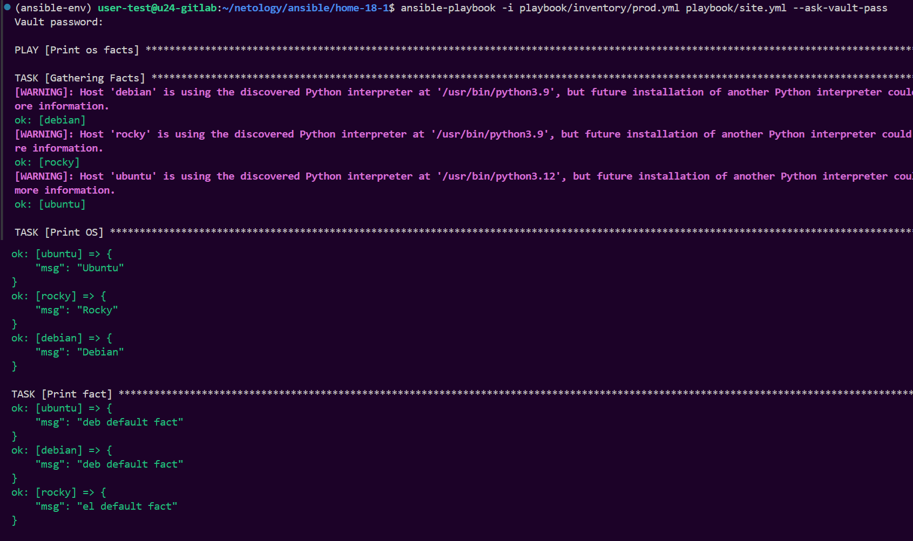
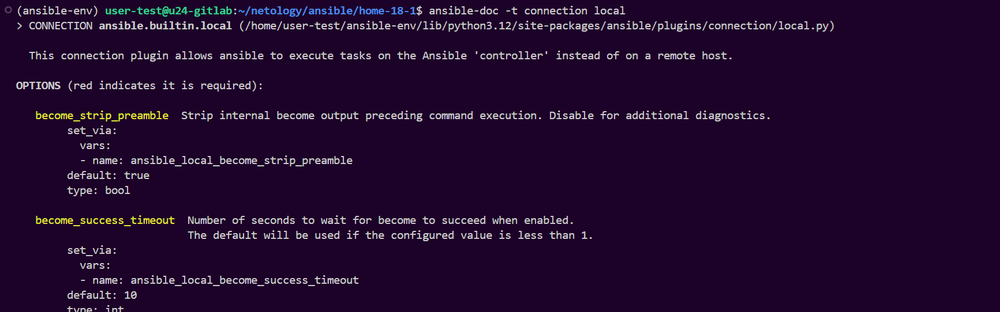
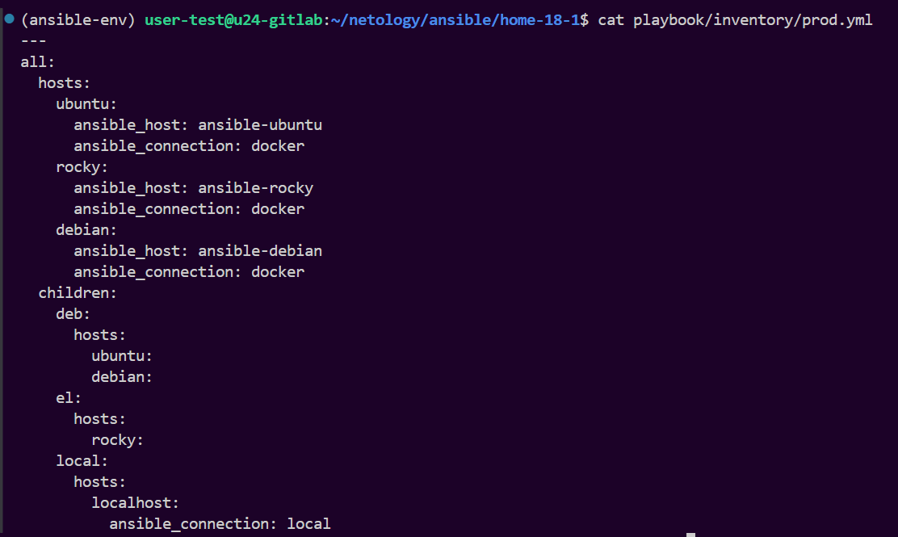
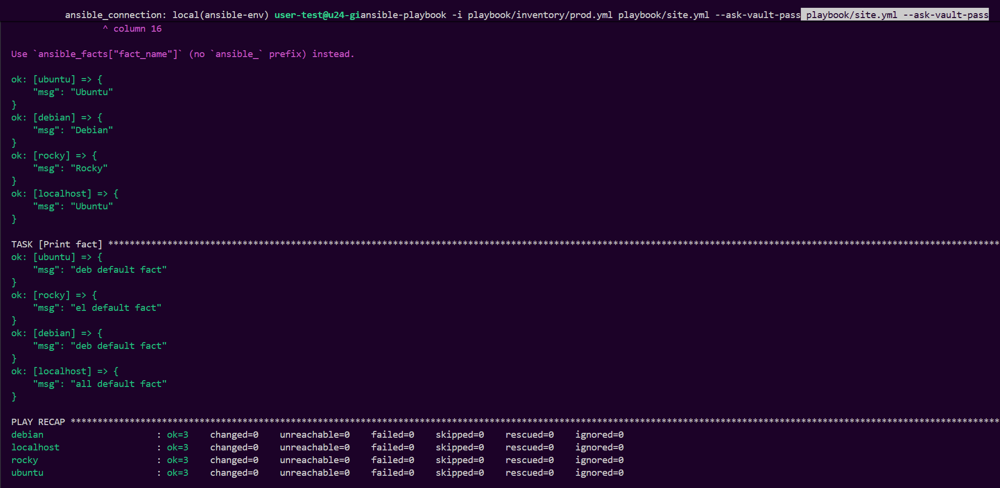

# Домашнее задание к занятию 18.1 "`Введение в Ansible`" - `Маховский Виктор`

## Подготовка к выполнению

1. Установите Ansible версии 2.10 или выше.
2. Создайте свой публичный репозиторий на GitHub с произвольным именем.
3. Скачайте [Playbook](./playbook/) из репозитория с домашним заданием и перенесите его в свой репозиторий.

## Основная часть

1. Попробуйте запустить playbook на окружении из `test.yml`, зафиксируйте значение, которое имеет факт `some_fact` для указанного хоста при выполнении playbook.

### Ответ:

**Результат:** Значение `some_fact` для хоста `localhost` = **12**


<details>
<summary>Результат: </summary>

```
(ansible-env) user-test@u24-gitlab:~/netology/ansible/home-18-1$ ansible-playbook -i playbook/inventory/test.yml playbook/site.yml

PLAY [Print os facts] ***************************************************************************************************************************************************************************************************************************************************************************************

TASK [Gathering Facts] **************************************************************************************************************************************************************************************************************************************************************************************
[WARNING]: Host 'localhost' is using the discovered Python interpreter at '/home/user-test/ansible-env/bin/python3.12', but future installation of another Python interpreter could cause a different interpreter to be discovered. See https://docs.ansible.com/ansible-core/2.20/reference_appendices/interpreter_discovery.html for more information.
ok: [localhost]

TASK [Print OS] *********************************************************************************************************************************************************************************************************************************************************************************************
[WARNING]: Deprecation warnings can be disabled by setting `deprecation_warnings=False` in ansible.cfg.
[DEPRECATION WARNING]: INJECT_FACTS_AS_VARS default to `True` is deprecated, top-level facts will not be auto injected after the change. This feature will be removed from ansible-core version 2.24.
Origin: /home/user-test/netology/ansible/home-18-1/playbook/site.yml:7:16

5       - name: Print OS
6         debug:
7           msg: "{{ ansible_distribution }}"
                 ^ column 16

Use `ansible_facts["fact_name"]` (no `ansible_` prefix) instead.

ok: [localhost] => {
    "msg": "Ubuntu"
}

TASK [Print fact] *******************************************************************************************************************************************************************************************************************************************************************************************
ok: [localhost] => {
    "msg": 12
}

PLAY RECAP **************************************************************************************************************************************************************************************************************************************************************************************************
localhost                  : ok=3    changed=0    unreachable=0    failed=0    skipped=0    rescued=0    ignored=0  
```

</details>


---

2. Найдите файл с переменными (group_vars), в котором задаётся найденное в первом пункте значение, и поменяйте его на `all default fact`.

### Ответ:



---

3. Воспользуйтесь подготовленным (используется `docker`) или создайте собственное окружение для проведения дальнейших испытаний.

### Ответ:

**Создано Docker окружение с тремя контейнерами:**
- `ansible-ubuntu` (Ubuntu 24.04)
- `ansible-rocky` (Rocky Linux 9)  
- `ansible-debian` (Debian 11)

**docker-compose.yml:**
```yaml
version: '3.8'

services:
  ubuntu:
    image: ubuntu:24.04
    container_name: ansible-ubuntu
    command: sleep infinity
    restart: unless-stopped

  rocky:
    image: rockylinux:9
    container_name: ansible-rocky
    command: sleep infinity
    restart: unless-stopped

  debian:
    image: debian:11
    container_name: ansible-debian
    command: sleep infinity
    restart: unless-stopped
```



---

4. Проведите запуск playbook на окружении из `prod.yml`. Зафиксируйте полученные значения `some_fact` для каждого из `managed host`.

### Ответ:



---

5. Добавьте факты в `group_vars` каждой из групп хостов так, чтобы для `some_fact` получились значения: для `deb` — `deb default fact`, для `el` — `el default fact`.

### Ответ:

**Результат:** Получились значения:


<details>
<summary>Результат: </summary>

```
(ansible-env) user-test@u24-gitlab:~/netology/ansible/home-18-1$ tree
.
├── docker-compose.yml
└── playbook
    ├── group_vars
    │   ├── all
    │   │   └── examp.yml
    │   ├── deb
    │   │   └── examp.yml
    │   └── el
    │       └── examp.yml
    ├── inventory
    │   ├── prod.yml
    │   └── test.yml
    └── site.yml

7 directories, 7 files
(ansible-env) user-test@u24-gitlab:~/netology/ansible/home-18-1$ cat playbook/group_vars/deb/examp.yml
---
  some_fact: "deb default fact"
  (ansible-env) user-test@u24-gitlab:~/netology/ansible/home-18-1$ cat playbook/group_vars/el/examp.yml
---
  some_fact: "el default fact"
```

</details>


---

6.  Повторите запуск playbook на окружении `prod.yml`. Убедитесь, что выдаются корректные значения для всех хостов.

### Ответ:



---

7. При помощи `ansible-vault` зашифруйте факты в `group_vars/deb` и `group_vars/el` с паролем `netology`.

### Ответ:

**Шифрование файлов:**
```
ansible-vault encrypt playbook/group_vars/deb/examp.yml
ansible-vault encrypt playbook/group_vars/el/examp.yml
```



---

8. Запустите playbook на окружении `prod.yml`. При запуске `ansible` должен запросить у вас пароль. Убедитесь в работоспособности.

### Ответ:

**Запускаем playbook:**
```
ansible-playbook -i playbook/inventory/prod.yml playbook/site.yml --ask-vault-pass
```



---

9. Посмотрите при помощи `ansible-doc` список плагинов для подключения. Выберите подходящий для работы на `control node`.

### Ответ:

**ansible-doc:**
```
ansible-doc -t connection local
```



---

10. В `prod.yml` добавьте новую группу хостов с именем  `local`, в ней разместите localhost с необходимым типом подключения.

### Ответ:

**prod.yml:**
```
cat playbook/inventory/prod.yml 
```



---

11. Запустите playbook на окружении `prod.yml`. При запуске `ansible` должен запросить у вас пароль. Убедитесь, что факты `some_fact` для каждого из хостов определены из верных `group_vars`.

### Ответ:

**Запускаем playbook:**
```
ansible-playbook -i playbook/inventory/prod.yml playbook/site.yml --ask-vault-pass
```



---

12. Заполните `README.md` ответами на вопросы. Сделайте `git push` в ветку `master`. В ответе отправьте ссылку на ваш открытый репозиторий с изменённым `playbook` и заполненным `README.md`.

### Ответ:

**Git:**
```
# git status
# git add .
# git commit -m "Home 18-1 v.1"
# git push -u origin main
```


---

13. Предоставьте скриншоты результатов запуска команд.

## Необязательная часть

1. При помощи `ansible-vault` расшифруйте все зашифрованные файлы с переменными.
2. Зашифруйте отдельное значение `PaSSw0rd` для переменной `some_fact` паролем `netology`. Добавьте полученное значение в `group_vars/all/exmp.yml`.
3. Запустите `playbook`, убедитесь, что для нужных хостов применился новый `fact`.
4. Добавьте новую группу хостов `fedora`, самостоятельно придумайте для неё переменную. В качестве образа можно использовать [этот вариант](https://hub.docker.com/r/pycontribs/fedora).
5. Напишите скрипт на bash: автоматизируйте поднятие необходимых контейнеров, запуск ansible-playbook и остановку контейнеров.
6. Все изменения должны быть зафиксированы и отправлены в ваш личный репозиторий.

---

### Как оформить решение задания

Приложите ссылку на ваше решение в поле «Ссылка на решение» и нажмите «Отправить решение»
---


